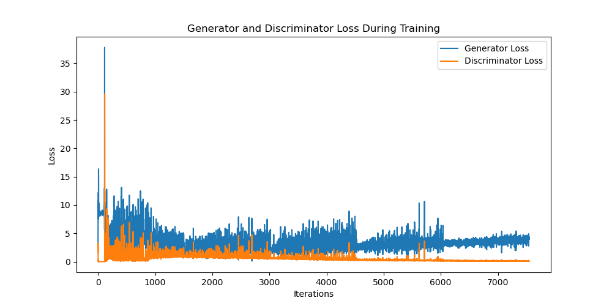
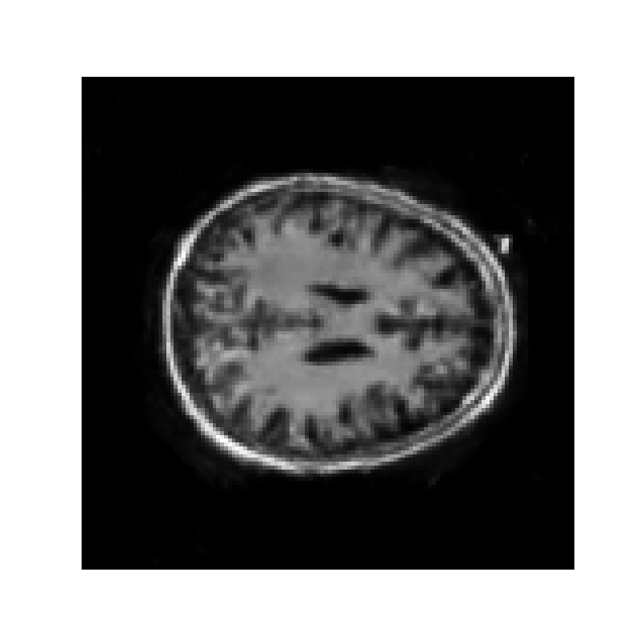
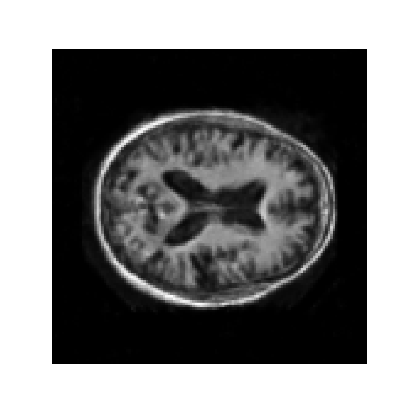
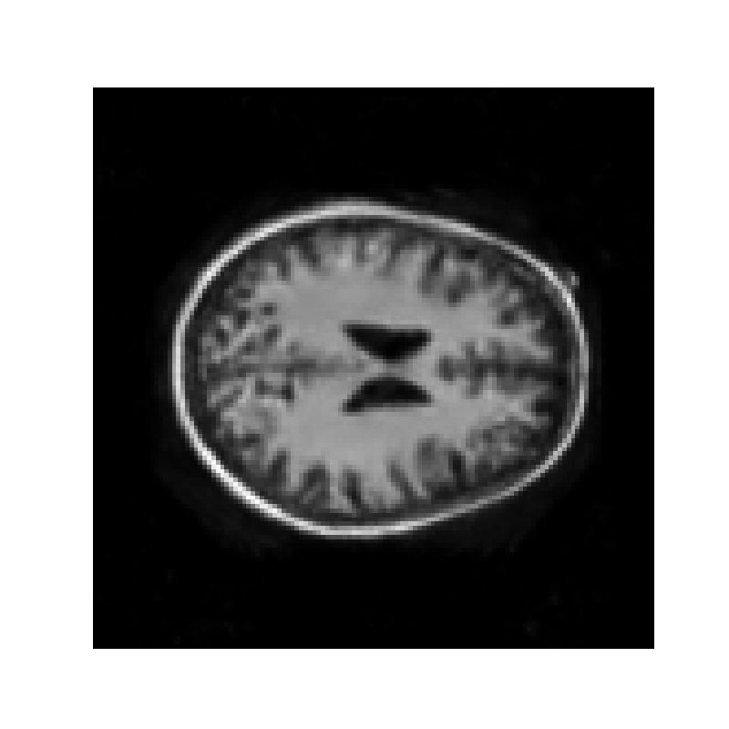
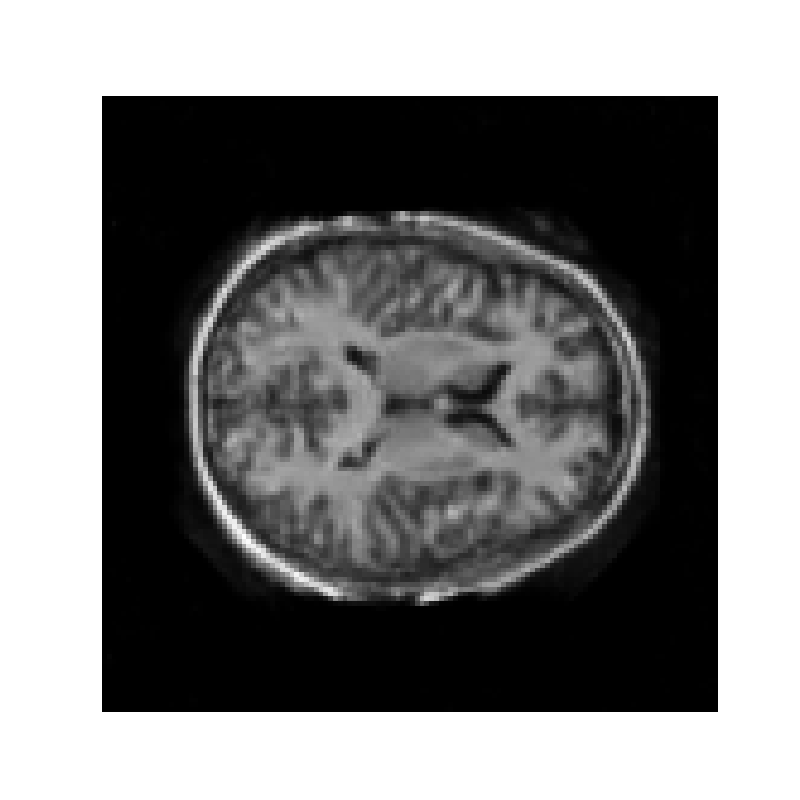

# GAN-for-MRI-Brian-Images
Author: Lok Yee Joey Cheung 

## Project Overview
This project leverages Generative Adversarial Networks (GANs) to generate realistic MRI brain images. By training on a dataset of MRI slices, the model aims to produce high-quality, synthetic brain images that can potentially aid in medical imaging researches.

## Principle of GAN in MRI Brain Image Generation 
Generative Adversarial Networks (GANs) are a class of machine learning frameworks that have shown significant promise in generating realistic data, such as images. In the context of generating MRI brain images, GANs can be used to create synthetic, high-quality MRI images from given input data. The process of generating MRI brain images with GANs involves two main components: the Generator and the Discriminator, which work together in a competitive process to improve the quality of generated images over time.

## OASIS dataset
The OASIS (Open Access Series of Imaging Studies) dataset is a widely used collection of neuroimaging data designed to facilitate research in the field of Alzheimer's disease (AD), dementia, and aging-related brain changes. The dataset provides a valuable resource for the development and evaluation of machine learning models, particularly in the areas of brain image segmentation, disease classification, and longitudinal studies.

## Usage

### Directory Structure
```
|-- gan.py                                              # Source code for model components
|-- keras_png_slices_data/keras_png_slices_test/        # Folder containing test dataset
|-- keras_png_slices_data/keras_png_slices_train/       # Folder containing train dataset
|-- keras_png_slices_data/keras_png_slices_validate/    # Folder containing validation dataset
|-- README.md                                           # Project documentation
|-- images/                                             # Folder for images and loss plot
```
### Implementation
1. Clone the Repository
```
git clone <repository_url>
cd <repository_folder>
```

2. Install Dependencies Run the following command to install the required libraries
```
pip install pandas pillow torch torchvision tqdm matplotlib
```

3. Explore the GAN implementation
``` 
python gan.py
```

## Data Preprocessing

- Images are loaded from directories and preprocessed with the following steps:
  - **Grayscale conversion**
  - **Resizing** to 128x128 pixels
  - **Normalization** to the range of [-1, 1]

## Training
### Architecture Summary

1. **Generator (G)**:
   - Takes a latent vector (100-dimensional) as input and generates a synthetic image.
   - Uses **transposed convolution layers** to progressively upscale the image to a target size (128x128).
   - Activation function: **ReLU** for hidden layers and **Tanh** for the output layer (to ensure image pixel values are in the range of [-1, 1]).
   
2. **Discriminator (D)**:
   - Takes an image as input and classifies it as real or fake.
   - Uses **convolutional layers** followed by **LeakyReLU** for activation to handle negative values effectively.
   - Final output is a single probability indicating whether the image is real or fake, using the **Sigmoid** activation.

### Hyperparameters

- **Generator**:
  - Latent vector size: **100** (input to the generator).
  - Output image size: **128x128** (grayscale).
  
- **Discriminator**:
  - Input image size: **128x128** (grayscale).
  
- **Learning Rate**:
  - Optimizers: **Adam** with learning rate **0.0002**.
  - Beta values for Adam optimizer: **(0.5, 0.999)** for better training stability.
  
- **Batch Size**: **64** (for both training and validation).
  
- **Epochs**: **50** (for training the GAN).
  
- **Loss Function**: **Binary Cross-Entropy Loss (BCELoss)** for both the generator and discriminator.

- **Learning Rate Scheduler**:
  - A **step scheduler** reduces the learning rate by a factor of 0.5 every **10 epochs**.

Below shows the generator and discriminator loss during training for 50 epochs: 


## Generated Images
Below are some generated brain samples: 



